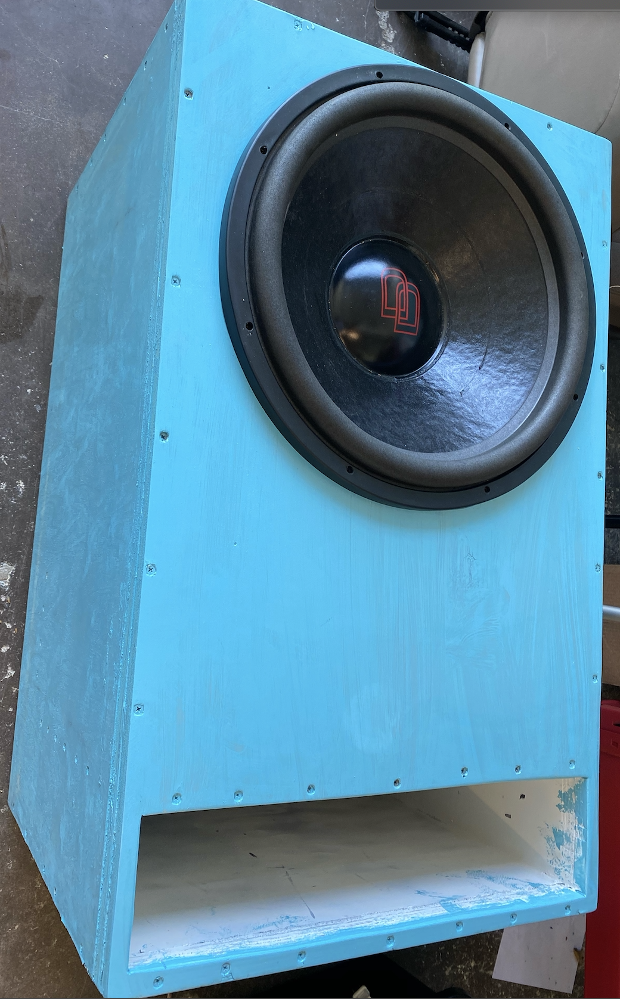

# SubWoofer Calculator App

iOS app that provides 4 different calculators to aid in the creation of subwoofer boxes.  

  

### Included Calculators

- Round Port Length
- Slot Port Length
- Rectangular Prism Volume
- Right-Angle Trapezoidal Prism Volume (Wedge)

## Background

Subwoofers are loudspeakers designed to produce low bass frequencies. In order to optimize both the sound quality and specific output frequencies of bass, boxes are designed to encase subwoofers in order to achieve these goals. The calculators included in this app aid in this construction process.

  

Subwoofers generate frequencies through the oscilating movement of its cone. In doing so, varying pressures are generated on the front and back of the cone. Although they are the same sounds, their relative wavelengths are offset. Therefore if they are heard together, their wavelengths cancel eachother out resulting in no sound heard. It is for this reason where subwoofer boxes come in.

Grossly simplying, the relative volume of a box and size of an included round or slot port affects the range of frequencies that can escape the box. Therefore controlling these dimensions, the box will output deisred frequencies much more clearly compared to other undesired ranges. Overall, different designs of boxes result in different listening experiences. 

## The Math Behind the Calculators

#### Calculating Port Length

- Area = Cross Sectional area of port (Circle vs. Rectangle)

  

  

  

#### Calculating Volume of A Rectangular Prism

  

#### Calculating Volume of A Right-Angle Trapezoidal Prism

  

  

  

